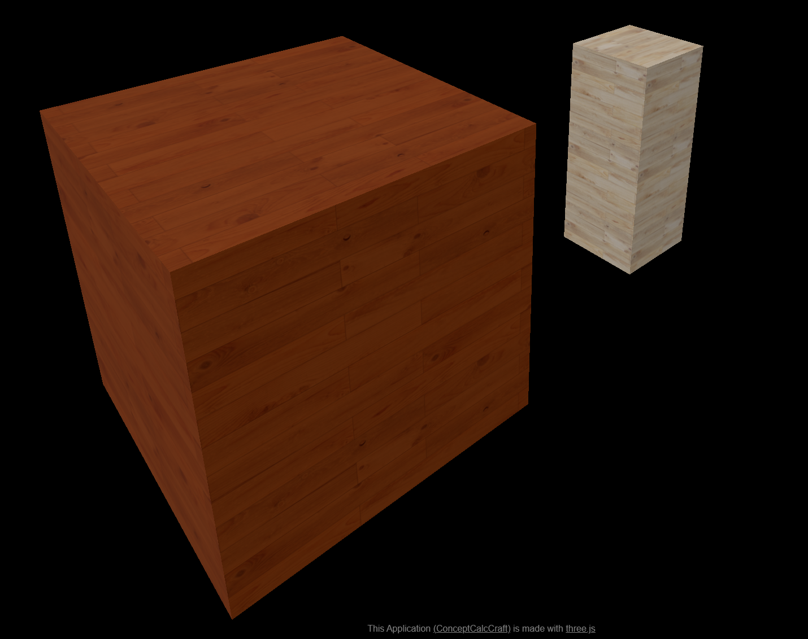
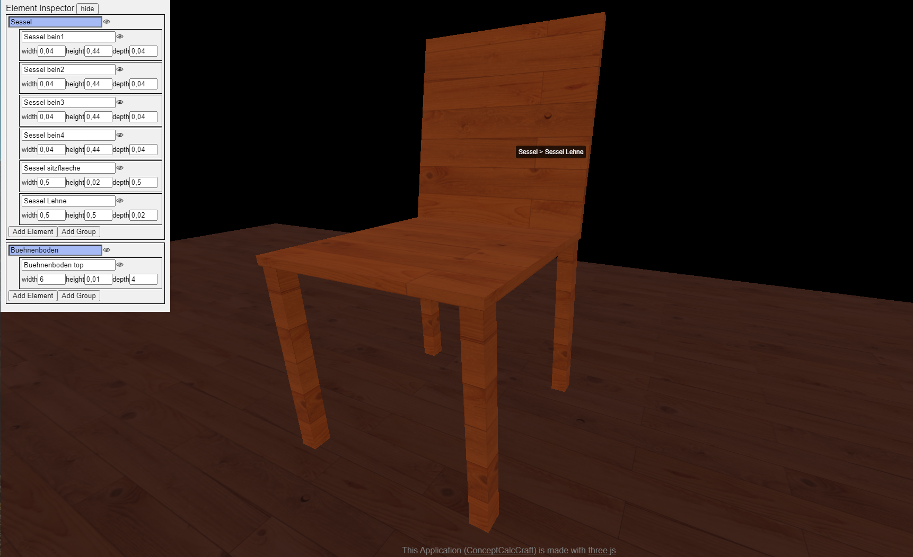

# ConceptCalcCraft

**ConceptCalcCraft** is an online tool for designing and building with wood.  It lets you (when it is finished) create 3D models, calculates wood usage, weight, and cost, and includes human models for perspective. Ideal for planning projects, big or small.

## About the Project

Building with wood and other materials has always been a passion of mine. I started helping a small theater group [Bunte Bühne Wien](https://www.instagram.com/buntebuehnewien/) with stage construction, where the need to share design ideas and calculate resources became apparent. From determining how much wood is needed for a project to estimating its cost and weight.

I wanted a tool that would make it easier to:

- Quickly visualize ideas in 3D.
- Accurately calculate material requirements.
- Share designs with others in a clear and structured way.
- Plan projects with realistic scale by including human models for perspective.

**ConceptCalcCraft** was born out of this need. It bridges the gap between creative design and practical planning, making it simple to turn concepts into detailed, actionable plans.

The application is built using Three.js, a powerful library for 3D rendering, which enables the creation of detailed and interactive models.

While developing this application, I made extensive use of ChatGPT to assist with programming tasks.

## Features and Todos

- [x] **3D Model view**: view designs directly in the browser.
- [ ] **3D Model edit**: Create directly in the browser.
- [ ] **Material Calculations**: Calculate wood usage, total weight, and cost.
- [ ] **Human Perspective**: Add scaled human models to ensure realistic sizing.
- [ ] **Resource Planning**: Simplify project planning and resource management.

## Screenshots

## License: 
Attribution-ShareAlike 4.0 International CC-BY-SA 

(details see LICENSE.txt file)

